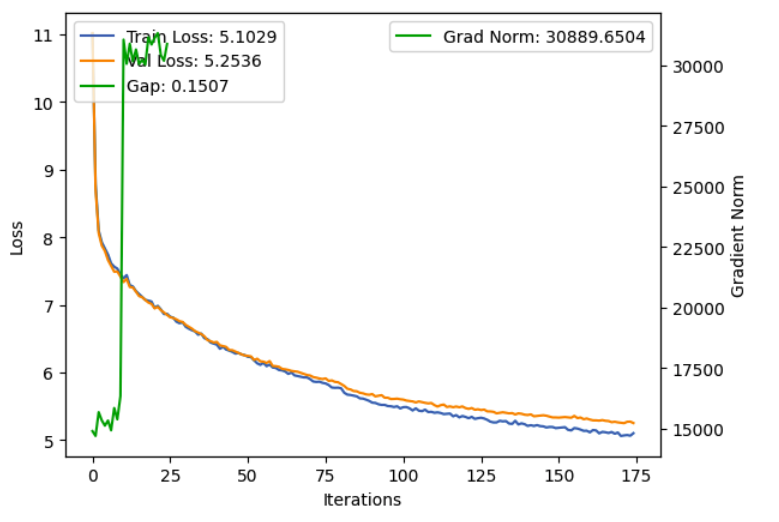

# mini-llm

## Overview

This project is focused on trying to get a GPT-2-like model trained on the HuggingFace [wikimedia/wikipedia](https://huggingface.co/datasets/wikimedia/wikipedia) dataset. 

## Model architecture

We use a custom built decoder-only Transformer architecture with multi-headed self-attention, with masked attention being performed using a lower triangular mask. 

## Data

We have a data pipeline to load the dataset either in a local cache on disk (`data_pipeline.py`) or streamed from the entire dataset (`streaming_data_pipeline`). We have built both pipelines to support distributed sampling so we can leverage DDP when multiple GPUs are available.

We leverage the GPT-2 tokenizer with two special tokens `<ARTICLE_START>` and `<ARTICLE_END>` to ensure we retain article boundaries.

## Training

We train the model by getting batches of data (usually 32 or 64) from the dataset and performing a standard training loop, evaluating the validation loss every `--eval_interval` steps. We use cross-entropy loss for evaluation. 

## Evaluation

I only have an MPS GPU on my local machine and so I have been relying on Lambda Labs' GPU instances for proper validation. I have achieved my best performance after running for 8-10 hours on a single GH200 GPU:

